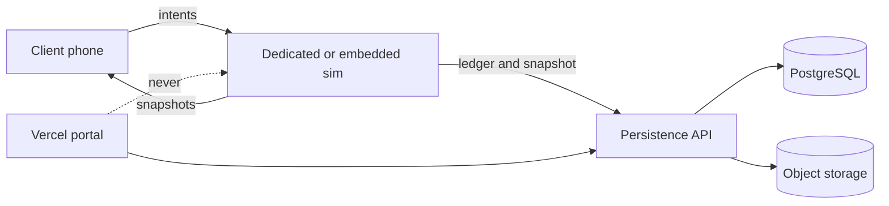
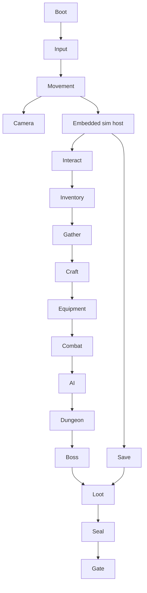

# VEYRMARCH
## Technical Architecture Bible
### Technical source of truth. Does not overwrite the design bible.

| Field | Value |
| --- | --- |
| Game | VEYRMARCH — The Sealed Continent |
| Creative source | `MASTER_GAME_DESIGN_BIBLE.md` |
| This document | Technical source of truth for implementation |
| Engine | Unity 6 / 6000.x LTS, URP |
| Platforms | iOS, Android first. PC later, same project |
| Session | 1–4 cooperative. No PvP in v1 |
| Status | Pre-implementation architecture |
| Audience | Claude and any other implementing agent |

Labels used in this document:

- **DECIDED** — implement this unless a human overturns it in the decision register.
- **OPEN** — blocked on a human.
- **DEFERRED** — real, but not in the vertical slice.
- **RISK** — known hazard with a mitigation, not a solved problem.

This document disagrees with the design bible where the design bible is technically unsafe. Disagreements are called out. The player experience is preserved.

---

# 0. Corrections to the design bible

These are not scope cuts. They are architecture corrections.

| # | Design bible claim | Problem | Recommendation | Label |
| --- | --- | --- | --- | --- |
| C1 | Listen-server on the player's phone, dedicated later | iOS suspends or kills a backgrounded app. A locked host phone kills the world. Mobile radios, thermals, and NAT make the phone a bad authority. A malicious host can mint loot. | Authority is a server process from the first online session. Solo/offline runs the same simulation in-process. The phone is never the authority for an online world. | DECIDED |
| C2 | Medium GPU budget "< 150 ms at 30 fps" | 30 fps is 33.3 ms total frame time. 150 ms is about 6 fps. The number is wrong. | CPU+GPU frame budget 33.3 ms at 30 fps. GPU target about 16–20 ms on Medium so the CPU still has room. | DECIDED |
| C3 | One 4 km continent, 64 m chunks, sim 3×3 | A single Unity Terrain of 4 km with dense props will not fit a phone. Four players in four regions would load four worlds. | Authored region tiles. Object chunks of 64 m. Terrain tiles of 128 m. One active region set per server, neighbours as impostors. Spread parties are pulled back or sim-LOD'd. | DECIDED |
| C4 | Structural collapse, magic platforms, partial destruction as if physics | Runtime PhysX collapse and terrain deformation do not replicate cleanly and will hitch phones. | Damage states and a support graph. Destruction is swapped prefabs. Magic platforms are ephemeral replicated entities with a TTL, not terrain edits. | DECIDED |
| C5 | NGO listen-server, revisit FishNet if feel fails | NGO is acceptable only if combat lag compensation is proven. NGO is not a rollback action engine. | Keep NGO for v1 **after** a combat spike. If parry at 150 ms RTT feels wrong, switch the net layer before content, not after ten bosses. | DECIDED |
| C6 | Cloud save "or equivalent" plus host trust | Split-brain saves duplicate boss uniques. | One persistence service. Boss rewards are a unique row per `(world, boss, character)`. Idempotency keys on every item birth. | DECIDED |
| C7 | ECS not now | Correct. Do not reverse this. | Pure C# simulation + MonoBehaviour presentation. Jobs/Burst only for scatter and culling. | DECIDED |

Everything else in the design bible stands: fists start, seal gates, Cookie as first boss, personal body / shared world, no class, Finster rite, density over size.

---

# 1. Executive technical summary

VEYRMARCH is one Unity project with three runtimes and one simulation.

1. **Client** — phone or later PC. Input, prediction of local movement, interpolation of remotes, presentation, UI.
2. **Simulation** — pure C# rules: combat, inventory, seals, crafting, AI decisions. No `UnityEngine` references in the core.
3. **Server host** — runs the simulation. Offline, it is in-process. Online, it is a headless Unity build, one process per active world.

The client never decides loot, seals, XP, or item creation.

## 1.1 Recommended stack

| Concern | Choice | Why | Rejected | Why rejected |
| --- | --- | --- | --- | --- |
| Engine | Unity 6 LTS, URP | Design lock. Mobile renderer. One project for iOS, Android, later PC. | Unreal, Godot | Brief locks Unity. Unreal mobile binary and team cost are worse for this team. |
| Simulation style | Pure C# domain + Unity adapters | Testable without a scene. AI agents can change rules without breaking scenes. | ECS/DOTS everywhere | Conversion cost, animator/nav fit, small team. Design bible already rejected it. |
| Netcode | Netcode for GameObjects 2.x + Unity Transport | Official, dedicated-server capable, enough for 4-player PvE if lag compensation is added for melee. | Photon Fusion | Vendor lock and CCU cost for a listen-or-hosted co-op that we will self-host. Revisit only if the combat spike fails. |
| | | | FishNet | Stronger prediction, but custom license and a second stack to learn. Hold as the spike fallback. |
| | | | Mirror | Prediction still weak for new action games. |
| | | | Netcode for Entities | Requires DOTS. |
| Online transport | Dedicated process with a public endpoint from a game host. Unity Relay only as fallback. | Phone must reach a stable IP. Relay adds latency. Use it when the host cannot give a port. | Phone listen-server + Relay | iOS lifecycle. See C1. |
| Accounts | Anonymous guest first, then Apple and Google link | Design: no login wall before music. | Mandatory account before menu | Violates the design. |
| Backend API | One modular HTTP API | Worlds, invites, snapshots, admin. Not realtime. | Microservices | Team of one plus agents. Operational fiction. |
| Database | PostgreSQL | Accounts, characters, item ledger, world metadata, seals. | Mongo as primary | We need unique constraints for anti-duplication. |
| World snapshots | Object storage (S3-compatible, Cloudflare R2 acceptable) | Large world blobs, cheap, versioned. | World rows per prop in SQL | Cost and write amplification. |
| Cache | None in v1. Add Redis only for rate limits and presence if the API needs it. | Avoid a second database before there is a measured problem. | Redis on day one | Extra failure mode. |
| Queue | None in v1. Inline jobs in the API. | Snapshot copy and analytics batch do not need Kafka. | Kafka, Rabbit | Premature. |
| Website / portal | Vercel | Static site, account portal, news. | Vercel as game server | Vercel is request/response. It cannot tick a world. **Vercel must not host the simulation.** |
| Game host | One VM or a game-server host (Hetzner, Fly.io machine, or Edgegap/Multiplay) running headless Unity | One process per awake world. Sleep when empty. | Kubernetes | Not required below a fleet. Revisit past ~10k CCU. |
| Analytics | PostHog cloud or self-hosted, opt-out | Funnels without selling data. | A custom warehouse | Not yet. |
| Crash | Sentry + Unity Cloud Diagnostics | Client crashes and server exceptions. | Logs only | Cannot debug phones. |
| CI | GitHub Actions + GameCI | Edit-mode tests on PR. Device builds nightly. | Manual only | Agents will break the project. |
| Content | Addressables, remote catalog later | Region packs. | One giant build forever | Store size and memory. |
| Config | Versioned JSON in the build for balance. Remote config only for event rates, never silent boss-stat changes without a content version. | Saves must match the content they were written with. | Live ops silently retuning Cookie | Breaks tells and saves. |

**DECIDED** overall shape: client → dedicated (or embedded) simulation → snapshot/ledger persistence. One API. One Postgres. One object store. Vercel is the shop window, not the castle.

---

# 2. Architecture principles

1. **Server authority.** Damage, loot, seals, XP, crafting, and building commits happen in the simulation. The client sends intents.
2. **Deterministic ownership.** Every entity has one owner: server. Clients have input ownership of their player intent only.
3. **Shared world, owned body.** World flags live on the world. Body, skills, and soulbound items live on the character. Never one blob.
4. **Data-driven content.** Items, spells, recipes, bosses, quests are definitions (ScriptableObject authoring, exported to JSON the server can load). A new sword is data.
5. **Mobile-first budgets.** If a feature misses the frame or memory budget, it does not ship at that quality tier. It gets an LOD or it waits.
6. **Bounded simulation.** Caps on AI, projectiles, build pieces, ephemeral magic props, and active chunks. Unbounded systems are defects.
7. **Pure rules, dirty presentation.** Gameplay rules do not call `Instantiate`. Adapters do.
8. **Explicit state.** Bosses, gates, sessions, and crafts are state machines with named transitions. No boolean piles.
9. **Versioned persistence.** Every save has a schema version. Migrations are code, not hope.
10. **Idempotent mutations.** Every item birth has a key. Retries do not duplicate Cookie’s Blade.
11. **Graceful failure.** Disconnect, crash, and suspend have a defined recovery. They do not corrupt.
12. **Observability.** Server tick time, entity counts, and save results are measurable.
13. **No hidden globals.** No `GameManager.Instance` that owns the game. A composition root wires services.
14. **No client-authoritative inventory or progression.** Including in offline mode: the embedded server is the authority, the UI is not.
15. **Slice before platform.** The forest must run on a phone before a second region exists in code.
16. **AI agents edit inside boundaries.** An agent does not rename assemblies or replace the net stack in a feature PR.

---

# 3. Unity project architecture

```
Veyrmarch/
  Assets/
    _Project/
      Art/                  # source-imported, not referenced by code
      Audio/
      Content/              # ScriptableObject definitions
        Items/
        Spells/
        Recipes/
        Bosses/
        Quests/
        LootTables/
        Regions/
      Prefabs/
        Characters/
        Mobs/
        Props/
        UI/
        VFX/
      Scenes/
        Boot.unity
        Client/
        Server/
        Regions/
        Dungeons/
      UI/
      VFX/
      Addressables/         # groups and labels, not a dump of assets
    Tests/
      EditMode/
      PlayMode/
  Packages/
    manifest.json
  ProjectSettings/
  Server/                   # headless build extras, dockerfile or launch scripts
  Docs/
    design/                 # copy or link of the design bible
    architecture/           # this bible
    adr/                    # decision records
  tools/
```

No assets in `Resources/`. Loading is explicit or Addressables.

## 3.1 Assemblies

Dependency direction is one way. No cycles.

```
Veyr.Sim            pure C#, no UnityEngine
Veyr.Content.Model  ids, DTOs, definition records (no Unity)
        ↑
Veyr.Unity.Content  ScriptableObject adapters, authoring
Veyr.Net            NGO messages, serializers
Veyr.Server         tick, AI host, save triggers (Unity, headless-safe)
Veyr.Client         input, camera, UI, prediction presentation
Veyr.Shared.Unity   math helpers that need Unity types, thin
Veyr.Editor         editor only
Veyr.Tests.Sim      edit-mode tests of rules
Veyr.Tests.Play     play-mode smoke
```

`Veyr.Sim` may not reference `Veyr.Client` or `Veyr.Server`. `Veyr.Client` may not reference `Veyr.Server`. Both reference `Veyr.Sim` and `Veyr.Net`.

Generated code: NGO does not require generated serializers if messages stay plain structs. Do not add a codegen framework in v1.

Server-specific code is anything that must not ship secrets or admin cheats in the client build. Client builds define `VEYRMARCH_CLIENT`. Server builds define `VEYRMARCH_SERVER`. Shared sim is in both.

---

# 4. Code architecture

| Tool | Use | Do not use for |
| --- | --- | --- |
| Pure C# | Rules, inventories, combat resolution, quest state, loot rolls | Rendering |
| MonoBehaviour | View, animation bridge, NGO network behaviour adapters | Business rules |
| ScriptableObject | Authoring definitions in editor | Runtime mutated state |
| State machines | Boss, session, gate, player life, cast | AI utility soup in the slice |
| C# events / explicit bus | Presentation reactions inside a scene | Cross-system authority |
| Jobs/Burst | Foliage scatter, frustum cull helpers, if measured | Gameplay |
| ECS | Nothing in v1 | — |
| Dependency injection container | Not in v1 | — |
| Service locator | Not allowed | — |

Composition root: `Boot` scene creates `SessionContext` and registers the embedded or remote endpoint. Systems receive dependencies in constructors. Unity adapters are thin.

**DECIDED:** no Zenject/VContainer until a human asks. Constructor injection in sim, serialized references in views.

---

# 5. Core game systems

Each system: purpose, responsibilities, inputs, outputs, dependencies, authority, persistence, networking, performance, testing.

### Player / character
Purpose: the owned body. Responsibilities: identity, appearance blob, life state. Inputs: intents. Outputs: replicated transform and vitals. Dependencies: input, stats, equipment. Authority: server. Persistence: character document. Networking: spawn, vitals at send rate. Performance: one animator near, LOD far. Testing: spawn, die, respawn.

### Character creator
Purpose: appearance. Responsibilities: write appearance blob < 4 KB. Inputs: UI. Outputs: blob on character. Authority: client authors cosmetics, server stores. Persistence: character. Networking: replicate blob on spawn, not slider streams. Performance: preview rig only in creator. Testing: extremes still bind armour.

### Input
Purpose: map touch and later gamepad to intents. Responsibilities: control schemes, rebinding. Inputs: hardware. Outputs: `PlayerIntent` per tick. Authority: client produces, server validates. Persistence: control layout in local settings, not the cloud. Networking: intents only. Performance: no alloc per frame. Testing: scheme switch.

### Movement
Purpose: walk, sprint, jump, crouch, swim, marked climb. Inputs: intent, world collision. Outputs: position. Authority: server corrects. Client predicts local. Persistence: last stable position. Networking: prediction + correction. Performance: CharacterController, not Rigidbody ragdoll. Testing: speed cap rejection.

### Camera
Purpose: orbit, combat bias, lock-on, collision pull-in. Inputs: look, target. Outputs: camera pose. Authority: local presentation only. Persistence: none. Networking: none. Performance: no post-process dependency. Testing: never enters body.

### Combat
See §7. Authority: server. Persistence: none except downed/dead flags. Networking: intents in, hit events out.

### Weapons / armour / equipment
Purpose: change verbs, not only numbers. Inputs: equip intent. Outputs: stat block, moveset id. Authority: server. Persistence: equipment slots on character. Networking: equipped def ids. Performance: one active moveset. Testing: slot rules, two-hand conflicts.

### Inventory
Purpose: carry and store. Inputs: transfer intents. Outputs: stacks and instances. Authority: server only. Persistence: inventory document + item rows. Networking: owner receives full inventory, others do not. Performance: no per-frame scan. Testing: duplicate retry, overflow.

### Stats / skills / XP / levels
Purpose: evidence of use, plus level points. Inputs: events (hit, mine, craft). Outputs: derived sheet. Authority: server. Persistence: character. Networking: sheet to owner, public subset to others (level, equipped). Performance: recompute on change, not per tick. Testing: fists do not grant sword rank.

### Magic / abilities
Purpose: data-driven casts. Inputs: cast intent. Outputs: effects, ephemeral entities. Authority: server. Persistence: known spells, corruption. Networking: cast event, projectile snapshots. Performance: projectile cap. Testing: cost, cooldown, school gate.

### Status / health / stamina / death / respawn
Purpose: life loop. Inputs: damage, time. Outputs: life state. Authority: server. Persistence: life state only at save points, not every tick. Networking: vitals. Performance: status cap per actor. Testing: mode rules in §25.

### Loot
Purpose: birth items legally. Inputs: death or chest event. Outputs: item instances. Authority: server. Persistence: immediate for uniques. Networking: loot grant to owner. Performance: roll from table, no scene search. Testing: unique constraint, co-op personal grant.

### Crafting / stations
Purpose: recipes to items. Inputs: craft intent. Outputs: consume + create in one transaction. Authority: server. Persistence: with inventory write. Networking: result. Performance: no queue sim in slice (instant craft). Testing: cannot skip tier.

### Gathering (mine, wood, fish, farm)
Purpose: nodes to materials. Inputs: interact. Outputs: stack deltas, node state. Authority: server. Persistence: node depletion on world if it matters (boss gates), trivial nodes may respawn from seed. Networking: node state in chunk. Performance: nodes are data, not AI. Testing: pick tier gate.

### Cooking / alchemy / enchanting
Same transaction path as crafting. Different station tags and skill gates. **DEFERRED** past slice except campfire food if the slice needs a heal item. Slice heal can be a bandage recipe.

### Building
See §15. **DEFERRED** beyond bedroll, fire, bench in the slice.

### NPCs / dialogue / AI
See §13. Authority: server for quest-critical positions. Persistence: flags, not paths.

### Quests
See §28. Authority: server. Personal quests on character, world quests on world.

### Settlements / economy
**DEFERRED.** Slice has Hearthfen as authored NPCs and a bench, not a settlement sim. Gold can exist as a currency stack.

### World events
**DEFERRED.** Architecture: server scheduler, one major event flag on the world, telegraph, then spawn budget. Not in slice.

### Bosses / dungeons
See §26 and §27.

### Mounts / boats / glider
**DEFERRED.** Traversal interface reserved: `ITraversalMode`. Slice is on foot.

### Swimming / climbing
Slice: no swim. Climb is marked mantle only (one animation, no stamina wall system). Full swim with breath is Drowned-region work.

### Fast travel / shrines
Slice: shrine is respawn and save point. Fast travel **DEFERRED** until the seal that enables it exists.

### Day / night / weather
Slice: authored cycle, 24 real minutes, lighting preset swap. Weather is a preset id, not a fluid sim.

### World state
Seals, gates, dungeon seeds, node overrides. Authority: server. Persistence: world document.

---

# 6. Player architecture

Five documents. They are not one save.

| Document | Owns | Does not own |
| --- | --- | --- |
| Account | auth ids, linked providers, entitlement, settings sync opt-in | position, loot |
| Character | appearance, stats, skills, inventory ids, personal quests, soulbound ids, death flags | seals, chests |
| World | seed, mode, seals, buildings, chests, dungeon seeds, NPC flags, discovery shared | player XP |
| Party / session | who is in this process, roles, reconnect tokens | long-term loot |
| Runtime | tick state, AI, projectiles | anything that must survive a crash without a snapshot |

Ownership: the server process mutates world and, through the persistence service, character. The client holds a cache.

A character may enter a world if they are a member or have an invite. Membership is `world_members`. Progression mismatch is legal: the world may be ahead of the body. See §24.

---

# 7. Combat architecture

## 7.1 What runs where

| Concern | Client | Server |
| --- | --- | --- |
| Input sampling | Yes | No |
| Local movement prediction | Yes | Corrects |
| Attack animation start | Predicted cosmetic | Confirms or rejects |
| Hit detection | Cosmetic only | Authoritative, rewind buffer |
| Damage numbers | Display granted events | Computes |
| Parry window | Predicted flash | Validates against buffered poses |
| i-frames | Predicted | Authoritative |
| Stamina spend | Predicted | Authoritative, may rubber-band |
| Projectiles | Interpolated | Spawned and hit-tested |
| Boss phase | Display | State machine |
| Loot | Display | Creates |

## 7.2 Hit validation

Server stores 200 ms of hurtbox poses (about 4 ticks at 20 Hz, store substeps if needed). On attack intent with client tick `T`, server rewinds targets to `T` clamped to the buffer, tests the attack shape, applies damage, then discards the rewind.

Cheats rejected: damage amount from client, cooldown skip, attack without stamina, hit outside range plus slack (0.5 m), attack while dead or staggered.

## 7.3 Feel on mobile networks

Target design RTT: 80–150 ms. Player sees their swing immediately. Hit markers wait for the server unless the spike proves a safe predicted hit flash. Parry is the risky one. The combat spike must record parry success at 150 ms RTT before Cookie is built on top of the net layer.

Tick: simulation 20 Hz. Send: 20 Hz for local player state during combat, 10 Hz when exploring. Remotes interpolated over 100 ms.

## 7.4 Boss mechanics

Telegraphs are server timers replicated as phase + attack id + start tick. Client renders the tell from that. The Finster circle is per-player, start ticks staggered by 10 ticks (0.5 s) at 20 Hz. Resolution is position at server tick, not client claim.

---

# 8. Multiplayer architecture



- Relationship: clients are thin. One sim owns the world instance.
- Dedicated: yes for any session that is not solo-offline.
- Replication: NGO NetworkVariables for vitals and phase. Unreliable transform sync for movers. Reliable messages for inventory and loot.
- Interpolation: remotes only.
- Prediction: local pawn movement and cosmetic attack start.
- Reconciliation: server snapshot wins. Small error smoothed. Large error snapped.
- Tick 20. Snapshot send 10–20. Relevancy: chunk interest, radius 100 m. Outside that, no mob updates.
- Spawning: server only.
- Ownership: server. Players own input.
- RPCs: client → server intents only (`TryAttack`, `TryCraft`, `TryPlace`). Server → client events (`HitConfirmed`, `LootGranted`).
- Reliable: inventory, quest, seal, chat. Unreliable: movement.
- Reconnect: 90 s token, same process if alive, else new process from snapshot.
- Host migration: not applicable. There is no player host. If the process dies, a new process loads the snapshot.
- Join: invite code or party id. Discovery is private in v1. No public matchmaking.
- Friends: invite codes first. Platform friends **DEFERRED**.
- Security: server validates every intent. Clients never send item ids to create.

The client is never allowed to decide: damage, drops, XP, seal flags, recipe success, gold, chest contents, boss phase, building existence, quest completion.

---

# 9. Server architecture

One process owns one world instance. Regions are not separate servers in v1. A world is small enough. Splitting regions would fork seals and is rejected until a profiler proves one process cannot hold a 4-player slice. It can.

| Clock | Value |
| --- | --- |
| Simulation tick | 20 Hz |
| Network send | 10 Hz explore, 20 Hz combat |
| Persistence interval | 30 s if dirty |
| Autosave | same, plus immediate on seal, unique loot, building commit |
| Shutdown save | always, flush ledger |
| Reconnect window | 90 s |
| Empty world | sleep after 5 min, snapshot, process exit |
| AFK | 15 min idle → kick from online session, character saved at shrine |

AI, combat, loot, and seals run inside the tick. Economy and events are tick checks, not separate services.

Offline solo: same `WorldSimulation` in-process, persistence to local files with the same schema.

---

# 10. World architecture

Coordinates: one world space, origin near Hearthfen, Y up, 1 unit = 1 metre. Regions are authored bounds, not separate coordinates.

| Layer | Size | Why |
| --- | --- | --- |
| Region | Design footprints in the bible | Authored streaming unit |
| Terrain tile | 128 m | Mobile terrain piece, hole-friendly |
| Object chunk | 64 m | Spawn and relevancy unit matching the design |
| Dungeon | Subscene, own bounds | Unload overworld interior |

Underground and caves are tiles with a layer id, not a voxel octree. Skylands are tiles with a height offset. Void is a dungeon subscene, not open land.

Water is a shader plane per tile, not a simulated volume. Vegetation is instanced on the tile. Resource nodes are records in the chunk. NPC homes are authored points. Events are world flags plus spawn tables.

Seed: `world.seed` drives scatter only. Landmarks ignore the seed.

Loading: addressable tile. Unload when no player interest and no dirty state. Persistence: deltas (buildings, depleted story nodes, chests), not the whole scatter. Scatter rebuilds from seed.

---

# 11. World streaming

| Radius | Medium phone | Low |
| --- | --- | --- |
| Render | 160 m | 100 m |
| Simulation | 80 m | 64 m |
| Network relevance | 100 m | 100 m |
| Impostor horizon | 400 m, baked meshes | 250 m |

Background: Addressables async. No full-screen load between forest and gate. Dungeon entry may show a short fade (< 3 s target) because the overworld unloads. That is an accepted loading seam, not a continent seam.

Pooling: mobs, projectiles, hits. Memory: unload tile colliders beyond sim radius. Target resident < 1.2 GB on Medium, warning at 1.5 GB. Four players in one region share tiles. Four regions: server refuses full sim and tells the party to regroup. **DECIDED.**

---

# 12. Procedural generation

| Thing | Class |
| --- | --- |
| Terrain, roads, landmarks, boss arenas, Hearthfen, gates | Authored |
| Trees, rocks, grass | Procedural scatter from seed, density authored |
| Caves | Authored skeletons, prop scatter hybrid |
| Resource nodes | Authored veins, small scatter around them |
| Camps | Hybrid: authored pad, rolled prop kit |
| Loot mods | Procedural on common/rare, fixed on unique |
| Dungeons | Hybrid: authored skeleton, rolled room kit, seed stored on first open |
| NPCs of story | Authored |
| Villagers extra names | Procedural flavour, not gameplay |
| Villages | Authored |
| Boss arenas | Authored |

Important spaces are deterministic because they are placed, not because the generator is clever.

---

# 13. NPC AI

Bands, matching the design:

| Band | Distance | Behaviour |
| --- | --- | --- |
| Full | 0–60 m | Nav, schedule, dialogue, flee |
| Reduced | 60–200 m | Waypoint puppet, no dialogue load |
| Off-screen | beyond | Ledger only: job, last flag |

Cap full sim at 12, hostile AI at 15, per loaded area. Relationships are flags (`knows_finster_name`), not a social simulation. Tanic is quest-critical: server position, authored route, persisted story stage.

Schedules are tables of time → station. Interruptions (combat, event) are states, then return.

---

# 14. AI navigation

**DECIDED:** Unity NavMesh per loaded tile, baked offline, plus navmesh links for doors, bridges, and dungeon transitions. Runtime rebake is not allowed on device. Building pieces that block nav are carving obstacles, not rebakes. Flying enemies use a simpler waypoint volume, not NavMesh. Swimming enemies **DEFERRED** with the drowned region. Bosses use arena anchors and scripted motion more than free nav. Mounts **DEFERRED**.

If a built wall must block villagers, use NavMeshObstacle carving. Do not promise fully dynamic cities.

---

# 15. Building system

Slice: bedroll, campfire, bench. Place on a legal pad, server validates item cost and overlap, persists a piece record.

Full system later:

- 1 m snap, 90° rotation. 15° cosmetic only, no support role.
- Client sends `TryPlace(pieceId, cell, rot)`.
- Server checks permission, plot, support graph, cap, materials, then commits one transaction.
- Caps: camp 40, village 120, town 250, city 400 pieces. Lights capped separately (16 per settlement on Medium).
- Destruction: remove piece, server updates graph, unsupported set flagged. No PhysX collapse. A later tick swaps them to debris and deletes.
- Repair is a craft transaction.
- Blueprints are piece lists, **DEFERRED**.

---

# 16. Destructible environment

| Class | Examples | Persists | Resets |
| --- | --- | --- | --- |
| Gather node | flint, ore | depleted until respawn timer | timer or shrine day |
| Prop state | crates, doors | story doors yes, crates no | crates on chunk reload |
| Structure damage | boss arena tiles | during the fight only | on wipe or kill |
| Player building | walls | yes | never, except dismantle |
| Terrain | ground | never deformed | — |
| Magic platform | ice step | no, TTL 8 s | despawn |

This preserves "partially destructible" as readable damage states. It does not become Minecraft.

---

# 17. Inventory and item architecture

Definitions: `ItemDef` (id, stack, equip slot, rarity, tool tier). Authored as ScriptableObject, exported to a content manifest the server loads.

Instances: `ItemInstance` (instance id, def id, owner, stack count, durability, mods, soulbound, birth key).

Stacks merge only if def, mods, and durability band match. Uniques do not stack.

Boss loot: `LootGrant` with key `boss:{world}:{boss}:{character}`. Database unique index. Retry returns the same instance id.

Currency is a stack, not a special bypass. Quest items are flagged unsellable.

ScriptableObjects are not the inventory. They are the catalog.

---

# 18. Crafting

Recipes: `RecipeDef` (id, station, skill gate, inputs, output, content version). Versioned with the content manifest. Old worlds keep the manifest version they started, plus explicit migrations if an input must change.

Validation: server checks station range, skill, inputs, then one transaction: consume, create, grant skill-use event. No client-side success.

Slice queues: none. Craft is instant. Queues **DEFERRED** (they complicate disconnect).

Quality band is a modifier on the instance, not a new def, except uniques.

---

# 19. Save / persistence architecture

| Layer | Store | Frequency |
| --- | --- | --- |
| Account | Postgres | on link and settings |
| Character | Postgres | dirty 30 s, immediate on loot unique and level |
| World metadata | Postgres | on seal, membership |
| World delta snapshot | Object storage | 30 s dirty, shutdown, seal |
| Local offline | files, same schema | same rules |

Atomic write: temp file or temp blob, then swap. Postgres transactions for ledger rows. Previous snapshot retained (3).

Corruption: if checksum fails, load previous snapshot. If both fail, world opens read-only at last good seal and the player is told.

Conflict: one writer, the server process. No two processes may hold the same world lock. Lock row in Postgres with TTL.

Disconnect: client crash loses only unsaved prediction. Server keeps state. Phone suspend: client reconnects. If the server slept, cold start from snapshot (target < 20 s).

Boss reward disappearance is prevented by the unique grant row committing before the client is told success.

---

# 20. Database

PostgreSQL. Redis **DEFERRED**. Object storage for snapshots.

Core tables, deliberately few:

- `accounts`
- `auth_identities`
- `characters`
- `character_items` (instance rows, owner character or world container)
- `item_birth_keys` unique
- `worlds`
- `world_members`
- `world_seals`
- `boss_grants` unique `(world_id, boss_id, character_id)`
- `world_locks`
- `snapshots` (blob pointer, version, checksum)
- `sessions`
- `invites`

Buildings and chests live in the snapshot, not a row per plank. Quest flags live on character JSON and world JSON. Do not normalise every quest step.

Analytics events can be a separate table or PostHog. Not the gameplay source of truth.

---

# 21. Backend

| Work | Where |
| --- | --- |
| Input, UI, prediction | Client |
| Tick, AI, combat, loot | Game server |
| Accounts, invites, locks, ledger, snapshot index | API |
| Rows and constraints | Postgres |
| Blobs | Object storage |
| Site, news, admin UI | Vercel, calling the API |

The API does not tick the world. The game server does not serve the website.

Admin: a flagged account can inspect seals and restore a snapshot. No in-game admin panel in the client build.

---

# 22. Authentication

**DECIDED** shape, **OPEN** vendor: guest token first (device key + server-issued refresh). Link Apple and Google later. Session access token 1 hour, refresh 30 days, rotation on use.

Recovery: linked provider restores characters. Guest-only on a lost phone is unrecoverable unless they linked. The UI must say that before they care.

Device identity is not the account. Reinstall keeps the account only with the provider or a stored refresh token in the platform keychain.

---

# 23. Matchmaking and lobbies

v1 is private worlds, not matchmaking.

- Create world: API row, seed, mode, owner member.
- Join: invite code, server process started if asleep.
- Reconnect: session token, 90 s.
- Owner leave: world persists. Any member can start it. Owner is a permission, not a process.
- Server shutdown: snapshot, clients told, reconnect to new process.
- Public worlds: **DEFERRED**. Not in v1.

---

# 24. World ownership

| Fact | Owner | Join rule |
| --- | --- | --- |
| Seal / gate | World | Open for everyone in that world after the kill |
| Boss unique | Character who was in the arena grant set | A late joiner does not receive Cookie’s Blade |
| Shared chest | World | Permissioned |
| Skills, level, appearance | Character | Come with the body into any world they may enter |
| Story gossip personal | Character | Tanic lines can be per-character flags |
| Mode (Adventure/Survival) | World | Joiner accepts the world's mode |

A stronger character in an early world is soft-capped against trivial mobs (design). They are not capped against bosses. A weaker character in a cleared world can walk through open gates but cannot mine the next ore without the tool. Tools are not granted by the gate. The party can trade materials. Uniques are not tradable if soulbound. **DECIDED:** boss signature weapons are soulbound. Picks may be placed in the world stash by the owner so a friend can mine. That is a deliberate transfer, logged.

---

# 25. Death modes

| Rule | Adventure | Survival | Hardcore | Custom |
| --- | --- | --- | --- | --- |
| Respawn | Bed or shrine | Bed or shrine | Character dead | Toggle |
| Inventory | Keep | Drop carried non-soulbound at corpse. Equipped stays. Corpse 20 min. | Body lootable once by party | Toggle |
| Durability | Off | On. Uniques dull, do not break. | On | Toggle |
| World on death | Unchanged | Unchanged | Remains | — |
| Boss | Reset | Reset | Reset | — |
| New character | n/a | n/a | May join world if permitted, no gear inherit | — |
| Hunger | Off | Off | Off | Toggle, default off |
| Enemy band | Region | Region | Region + veteran optional | Toggle |

Co-op downed: 30 s, ally revive, else mode death. Revive is server-timed.

---

# 26. Bosses

One `BossController` state machine in sim: Idle, Intro, Phase, Transition, Dead, Reset. Content is data: phases, attacks, tells, health, weaknesses, loot table id, seal id.

Multiplayer: +40% HP per extra player present at pull. Mechanic split only if the def says so (Finster circles). Grant set is players alive or downed in the arena at the killing blow. Wipe resets phase, not the seal.

Persistent defeat: `world_seals` row. Arena can be re-entered. Boss does not respawn if the seal is set. Optional bosses respawn on a long timer and do not set seals.

Cookie through Finster are content packs on this machine, not new systems. Slice implements the machine once, on Cookie.

---

# 27. Dungeons

**DECIDED:** world-owned instances, not per-player, not left resident in the open world.

Entrance is a world object. Interior is a subscene. First open stores the graph seed on the world. All members see the same rooms. Boss room is part of that instance. Leaving despawns the interior when empty. This matches mobile memory and keeps co-op together.

Private per-player dungeons are rejected: they fork loot and story.

---

# 28. Quest system

`QuestDef` + `QuestState` (inactive, active, complete, failed). Steps are data: talk, enter volume, possess item, boss dead, craft. Server advances steps from events. Personal state on the character. Seal quests also write world flags.

No radiant counter quests in v1. A board later spawns a real camp id, still data.

Journal strings are keys, not literals.

---

# 29. Magic system

`SpellDef`: school, cost, cast time, cooldown, shape, status, vfx id, content gate. Server checks known, mana, corruption, cooldown, then spawns an effect entity. VFX is client-only from the event.

Environmental spells spawn ephemeral entities (§16), capped at 8 per caster. Forbidden corruption is a character stat. Haunt is a personal mob, not a world boss.

A new spell is a def and a prefab. It is not a core rewrite. Slice ships zero spells or one fire cantrip only after melee is fun. **DEFERRED** past first Cookie kill if schedule slips. The architecture still exists so it is not bolted on.

---

# 30. Equipment and stats

Base: Vitality, Endurance, Strength, Dexterity, Focus, Will, Fortune.

Derived, recomputed on change:

- Health from Vitality
- Stamina from Endurance
- Mana from Focus
- Load from Endurance
- Weapon damage from def + scaling attribute + skill rank
- Defence diminishing: `reduction = def / (def + K)` with K tuned per region, not flat immunity
- Resists separate per element
- Crit from Dex and dagger rank
- Move from armour mods

Set bonuses are def hooks, max one set. Unique modifiers are scripted ids in a fixed enum of effects the sim understands (`ConfuseOnHit`, `ParryMagicWindow`). No arbitrary script assets from the server. New unique verbs require a sim change on purpose. That is the safety valve against unmaintainable modifiers.

---

# 31. Mobile input

Unity Input System. Schemes: `Touch`, `Gamepad` (later, but the actions exist in slice).

Actions: Move, Look, Light, Heavy (hold Light), Dodge, Jump, Block, Ability, Interact, LockOn, QuickItem. UI and building are a separate map so gameplay buttons do not fire under menus.

Safe area and notch padding on the canvas. One-handed: combat cluster offset preset. Rebinding stored locally. Haptics on hit, parry, rite warning, with a mute.

Joystick is left. Look is drag on the right zone. Combat cluster bottom-right. Interact is context, one button.

---

# 32. Mobile performance

30 fps is the product. 60 fps is a High/Ultra option that must step down on thermal.

Frame budget at 30 fps: **33.3 ms**. Main thread target ≤ 14 ms. Render thread / GPU target ≤ 18 ms. Margin for OS.

| Profile | Resolution | FPS | Shadows | Resident warning | Active hostile AI | Full NPC | Draw calls target |
| --- | --- | --- | --- | --- | --- | --- | --- |
| Low | 720p dynamic | 30 | off or one blob | 1.0 GB | 8 | 6 | < 150 |
| Medium | 900p dynamic | 30 | one cascade | 1.2 GB | 12 | 10 | < 250 |
| High | 1080p dynamic | 30–60 | two cascades | 1.6 GB | 15 | 12 | < 400 |

Triangles: Medium visible budget about 300–500k, not a hard engine cap. Texture memory target < 400 MB. Bandwidth uplink < 40 KB/s explore, < 80 KB/s combat. Loading: boot to menu < 8 s, dungeon fade < 3 s. Thermal: if frame time > 40 ms for 10 s, drop resolution and foliage. Battery is a consequence of the cap, not a separate sim.

LOD on meshes. Occlusion culling baked where static. GPU instancing for foliage and props. ASTC textures. Mesh compression on. Pool mobs and VFX. Baked lighting for village. Dynamic lights: player, boss, 2 fires on Low. VFX cap 24 particles systems active. Animators culled offscreen. Physics: no ragdoll pile. Network: interest management.

The design bible’s 150 ms figure is withdrawn.

---

# 33. Rendering

URP mobile-friendly asset. Forward. One main directional. Baked GI for Hearthfen. Light probes for characters. Reflection probes only in High hero interiors. Fog is a linear or exponential volume, not volumetric on Low/Medium. Volumetrics High only, and never required for a tell.

Post: color grade and a cheap vignette. Bloom High only. Motion blur off. Water: opaque plane plus normal. Terrain: tiled, painted materials, no 4 km terrain component. Vegetation: indirect instancing. Sky: static or simple cycle. Weather: material and fog preset.

---

# 34. Asset pipeline

Not production-ready just because a generator emitted them. Every asset passes the budget table.

| Asset | Tris LOD0 | LOD1 | Texture |
| --- | --- | --- | --- |
| Player | 12–18k | 6k | 1–2k body |
| NPC | 6–8k | 3k | 1k atlas |
| Mob | 4–8k | 2k | 1k |
| Boss hero | 15–25k | 8k | 2k |
| Weapon | 1–3k | — | 1k |
| Building piece | 0.5–2k | 0.3k | atlas 1k |
| Tree | 1–2k + card | card | atlas |

Rig: one humanoid. Weapon sockets. Bosses may have a unique rig. Naming: `reg_forest_tree_a`, `wpn_cookie_blade`. Prefabs in `Prefabs/`, definitions in `Content/`. Materials use a small URP shader set (lit, foliage, water, vfx). No unique shader per prop.

---

# 35. Addressables / content

Groups: `boot`, `ui`, `forest`, `cookie_dungeon`, `kingdom` (later). Labels by region. Remote catalog **DEFERRED** until the second region. Slice is local Addressables so the pipeline exists without a CDN.

No giant scene: Boot, Forest streaming tiles, Cookie dungeon scene. Boss is a prefab, not a copied scene per phase.

---

# 36. Audio

Unity audio for the slice. Middleware **DEFERRED** unless mix complexity forces it. Banks compressed. Two music layers max on Low. Combat sidechain is a volume duck on the music bus when a tell event arrives. 3D audio for nearby emitters only, cap 16 voices. Boss line for Finster is a voiced clip plus subtitle key. Slice does not need that clip.

---

# 37. UI architecture

UI Toolkit or uGUI: **DECIDED uGUI** for the slice. Faster mobile device testing, more agent examples. HUD is a view on replicated vitals. Inventory, craft, and dialogue are screens fed by server snapshots. No gameplay rule in a button handler. Strings via keys. Safe area component on each root.

Screens: HUD, inventory, station, dialogue, menu, settings, boss bar. Map **DEFERRED** to a simple stamp list in the slice.

---

# 38. Localisation

All player-facing strings are keys in a table. English only at slice. Font supports Latin. Do not concatenate sentences. Finster’s line is a key, not a hardcoded UI joke. Names of bosses may remain proper nouns.

---

# 39. Accessibility

Text scale, subtitle toggle default on, colourblind shape tells, shake toggle, flash reduction, haptic toggle, hold-or-toggle sprint and block, control cluster offset. Boss tell windows may scale up to 1.25× in accessibility, not more.

---

# 40. Security / anti-cheat

Co-op threat model: duplication, forged grants, speed, teleport.

- Server simulates movement and rejects speed and teleport.
- Damage is server-only.
- Item birth keys and `boss_grants` unique index.
- Craft and chest writes are transactions.
- Quest steps advance from server events.
- Client builds contain no admin spawn.
- World lock prevents two servers writing one world.
- Listen-server cheat is avoided by not having a player authority.

No kernel anti-cheat. **DECIDED.**

---

# 41. Analytics

Opt-out. Events: boot, create, first craft, first kill, castle door, cookie attempt, cookie kill, gate, death, disconnect, fps bucket, device tier. No precise location history beyond region id. No contact list. No selling. PostHog or equivalent. Gameplay does not depend on analytics being up.

---

# 42. Crash reporting / observability

Client: Sentry or Cloud Diagnostics, with content version and device tier. Server: structured logs, tick time, entity count, save success. API: request logs and lock conflicts. Alerts: save failure, crash-free session drop, server restart loop. A production boss bug must be reproducible from a log that includes boss phase and tick.

---

# 43. Testing architecture

| Layer | Must cover |
| --- | --- |
| Edit-mode sim | damage, parry window math, craft transaction, unique key, seal flag, death modes |
| Play-mode | boot, move, save/load, one wolf |
| Server | reject speed, reject double grant |
| Networking | two clients, host process kill, reconnect |
| Device | 20 min forest, thermal, frame time |
| Content | Cookie phases reachable, gate blocks then opens |

A system is not done without the tests in §57. Performance tests are device runs, not editor FPS.

---

# 44. AI coding agent architecture

Docs live in `Docs/`. Agents read the design bible and this bible before a milestone.

Rules:

- One system per change set.
- Do not edit unrelated assemblies.
- Do not add a singleton manager.
- Do not put rules in MonoBehaviours.
- Do not change a **DECIDED** row without an ADR in `Docs/adr/`.
- Tests in `Veyr.Tests.Sim` for rule changes.
- No new framework.
- Generated or imported art is not "done".
- Stop at the milestone exit.

Definition of done is §57. Comments explain non-obvious authority, not narration.

---

# 45. Git / version control

Trunk-based, short branches: `slice/movement`, `slice/cookie`. Conventional commits. Tags for device builds `slice-0.1.0`. Git LFS for art, audio, and large binaries. No LFS for scripts. Main must compile. Rollback is revert plus snapshot schema compatibility, not force-push.

Unity: ignore `Library/`, `Temp/`, `Logs/`, `Obj/`. Commit `Packages/`, `ProjectSettings/`, `Assets/_Project`.

---

# 46. CI/CD

PR: edit-mode tests, assembly dependency check. Merge to main: edit-mode plus a headless play-mode smoke if stable. Nightly: Android development build. iOS on a tagged slice, because signing is **OPEN**. Server: headless Linux build on the same tag. Backend: API tests on PR. Release: tagged client, tagged server, content manifest hash recorded.

Failed tests block merge.

---

# 47. Development environments

| Env | Data | Server | Who |
| --- | --- | --- | --- |
| Local | local files or local Postgres | in-process | developer |
| Dev | dev Postgres, dev bucket | one dev VM | team |
| Staging | staging DB | staging VM | release candidate |
| Production | prod DB | prod host | players |

Separate credentials. No shared snapshot bucket. Production is not the editor.

---

# 48. Deployment architecture

| Piece | Where |
| --- | --- |
| Client | App Store, Play, later Steam/PC |
| Game server | Linux headless Unity on a VM or game host |
| API | same VM or a small app host (Fly.io) |
| Postgres | Neon, Supabase, or RDS — one instance per env |
| Object storage | R2 or S3 |
| Website / portal | Vercel |
| Admin | Vercel or API-only, not in the game binary |

**Vercel does not host the realtime server.** It cannot tick combat, and it should not.

Rejected as the core: PlayFab as the sim, Firebase as the database, Photon as a requirement, Kubernetes, a dozen functions.

---

# 49. Cost model

Rough, not quotes. Driver is awake dedicated processes, not the database.

| Stage | Assumption | Monthly order of magnitude |
| --- | --- | --- |
| Prototype | local + free tiers | 0–50 USD |
| 100 registered, < 10 CCU | one small VM, worlds sleep | 20–80 USD |
| 1,000 registered, ~50 CCU | a few VMs, snapshots | 100–400 USD |
| 10,000 registered, ~400 CCU | fleet of world processes, bandwidth | 1–4k USD |
| 100,000 registered, ~3k CCU | orchestration justified, CDN for content | 10k+ USD |

Unity headless is heavy. Cost jumps when empty worlds are left running. Sleep them. Database stays cheap if snapshots are blobs.

---

# 50. Scalability

1 player: in-process sim. 4 players: one process. 100 CCU: many processes, one each world, broker assigns. 1,000 CCU: same architecture, more machines, still no region sharding. 10,000+: process manager, still the same world-instance model. Do not design sharding now. The session size is 4. Scaling is horizontal copies of a small sim, not a bigger sim.

---

# 51. Failure modes

| Problem | Impact | Detection | Recovery | Prevention |
| --- | --- | --- | --- | --- |
| Server crash | World stops | Process exit alert | New process, last snapshot | Shutdown save, 30 s dirty |
| Client crash | Player gone | Disconnect | Reconnect 90 s | — |
| Internet drop | Same | Timeout | Reconnect | Token |
| Database outage | No new saves | API errors | Retry, keep process memory, refuse new joins | Health check |
| Duplicate request | Double loot | Birth key conflict | Return original | Unique index |
| Partial save | Torn world | Checksum | Previous snapshot | Temp swap |
| Corrupt save | Unloadable | Checksum fail | Previous | Keep 3 |
| Version mismatch | Bad client | Manifest hash | Refuse join, store prompt | Version gate |
| Reconnect late | Missed fight | Token expiry | Shrine spawn | 90 s window |
| App suspended | Host would have died | n/a on dedicated | Client reconnect | No phone authority |
| Battery dies | Client gone | Disconnect | As drop | — |
| New device | No guest restore | Login | Provider link | Warn in UI |
| Bad deploy | Crash loop | Health | Previous tag | Staging |
| Latency | Late parry | RTT metric | Interpolation, buffer | Combat spike |
| Packet loss | Rubber band | Loss metric | Unreliable move, reliable loot | Transport |
| AI bug | Softlock | Playtest | Reset NPC route | Caps and links |
| Boss bug | Unkillable | Wipe logs | Reset encounter | Phase tests |
| Inventory bug | Loss or dup | Ledger audit | Restore snapshot | Transactions |

---

# 52. Data versioning

- Save schema version on character and world.
- Content manifest hash.
- Protocol version on connect. Mismatch refuses.
- Migrations are explicit functions `v3 to v4`.
- Items keep def ids. Removed defs become "unknown" salvage, not crashes.
- Old worlds load if a migration exists. If not, the server refuses and reports.

---

# 53. Live update strategy

New regions are Addressable packs plus a manifest. New bosses are defs. Balance changes ship with a content version. Existing `boss_grants` remain. Do not reskin a unique into a different item id. Event rates may be remote config. Boss tells may not.

---

# 54. Vertical slice architecture

Must exist:

- Boot, input, camera, movement, one humanoid
- Embedded server path (even solo)
- Inventory, gather, craft bench, equipment
- Wolf and goblin, server hits
- Hearthfen puppets, Tanic talk
- Cookie dungeon subscene
- Boss machine, Cookie content, grants
- Seal flag and gate collider
- Transactional local save
- Low and Medium quality
- Device frame budget

Must not exist yet: accounts, dedicated fleet, magic schools, settlements, co-op (until the solo slice is fun — co-op is the next milestone, not a reason to delay the wolf), other regions beyond a vista.

Online dedicated is architected, not required to beat Cookie the first time. The sim API must already look like a server so co-op is not a rewrite.

---

# 55. Vertical slice dependency graph



Multiplayer remote clients attach after the embedded sim can complete Cookie. They are not on the critical path of the first device run.

---

# 56. Implementation order

1. Phase 0 — Repo, assemblies, boot scene, input actions, empty sim tick.
2. Phase 1 — Movement, camera, CharacterController, frame overlay.
3. Phase 2 — Embedded server, intent validation, speed cap.
4. Phase 3 — Interact, inventory, nodes, craft, equipment.
5. Phase 4 — Combat math tests, wolf, hit rewind stub, dodge.
6. Phase 5 — Hearthfen blockout, day cycle, Tanic dialogue.
7. Phase 6 — Dungeon subscene load.
8. Phase 7 — Boss machine and Cookie.
9. Phase 8 — Loot grant keys, seal, gate, save/load.
10. Phase 9 — Device pass, Low/Medium, 20 minutes.
11. Phase 10 — Dedicated process and two-client join.
12. Phase 11 — Accounts and cloud snapshot.
13. Later — Kingdom, magic, building depth, other bosses.

Do not start Phase 10 before Phase 9 has a recorded device session.

---

# 57. Definition of done

A system is done when:

- It meets the player-facing rule in the design bible, as corrected here.
- Authority is server-side, with a test that a forged client message fails.
- Persistence, if any, survives a kill mid-write.
- Edit-mode tests cover the rule.
- It stays inside the slice budget if it is in the slice.
- Mobile controls can reach it without a new permanent button, or the button is in the input map.
- Docs in the system folder state inputs, outputs, and authority.
- No unrelated refactor in the same change.

---

# 58. Architectural risks

| Rank | Risk | Mitigation |
| --- | --- | --- |
| CRITICAL | Parry/hit feel at mobile RTT on NGO | Combat spike before Cookie content lock |
| CRITICAL | Phone thermals in the forest | Forest is the first device test, not the last |
| CRITICAL | Save duplication | Birth keys, unique grants, one world lock |
| HIGH | iOS if someone revives listen-server | Banned by C1 |
| HIGH | 4 km terrain memory | Tiles, not one terrain |
| HIGH | Scope creep past the slice | Phase 9 gate |
| HIGH | Agent rewrites architecture | ADR rule |
| HIGH | Dungeon load hitches | Subscene budget, fade allowed |
| MEDIUM | NavMesh vs building | Obstacles, no runtime bake |
| MEDIUM | Magic environment persistence | TTL entities |
| MEDIUM | Underwater and sky later becoming new engines | Same motor, state flags |
| MEDIUM | Guest account loss | Link warning |
| MEDIUM | Dedicated cold start | 20 s budget, snapshot size cap |
| MEDIUM | uGUI/UI Toolkit regret | Accept uGUI for slice |
| LOW | Redis absence | Add when rate limits hurt |
| LOW | No voice | Subtitles |
| LOW | PC later | Same project, input scheme |
| LOW | Analytics outage | Non-blocking |
| LOW | LFS misuse | CI size check |
| LOW | Public matchmaking demand | Deferred on purpose |

---

# 59. Technical decisions

| Decision | Status | Reason | Alternatives | Consequences |
| --- | --- | --- | --- | --- |
| Unity 6 URP | DECIDED | Design lock, mobile | Unreal | One project |
| Pure C# sim | DECIDED | Tests, agents | ECS | Adapters required |
| Dedicated authority, embedded offline | DECIDED | iOS lifecycle, cheats | Listen-server | Hosting cost |
| NGO + Transport | DECIDED pending spike | Official, 4-player | FishNet, Fusion | Spike can overturn |
| Postgres + object snapshots | DECIDED | Constraints + blob cost | Full SQL world | Snapshot migrations |
| No Redis v1 | DECIDED | Simpler | Redis day one | Add later |
| Vercel not sim | DECIDED | Wrong runtime | Serverless ticks | Portal only |
| uGUI slice | DECIDED | Speed | UI Toolkit | Possible later port |
| Dungeon world instances | DECIDED | Co-op and memory | Per-player | Shared seed |
| Soulbound boss weapons | DECIDED | Anti-trade exploit of uniques | Full trade | Picks can be stashed |
| No hunger default | DECIDED | Design | Survival hunger | Custom only |
| Guest then link | DECIDED shape | No menu wall | Mandatory login | Vendor OPEN |
| Game host vendor | OPEN | Cost and ports | Multiplay, Hetzner, Fly | Blocks production, not slice |
| Auth vendor | OPEN | Apple/Google | Unity Auth, Supabase | Blocks cloud, not slice |
| iOS signing | OPEN | Human account | — | Blocks store |
| Monetisation | OPEN | Not designed | Premium | Do not build a shop |
| FishNet fallback | DEFERRED | Only if spike fails | — | Possible net rewrite |
| Public worlds | DEFERRED | v1 private | Matchmaking | — |
| Kubernetes | DEFERRED | No fleet yet | Now | Rejected until 10k CCU |

---

# 60. Open questions

Critical before development:

- None that block Phase 0–9, if guest-local is allowed. Confirm offline solo is acceptable for the first device build.

Important before vertical slice is called shippable:

- Auth vendor and whether cloud save is in the slice or the milestone after.
- iOS signing owner.
- Whether Boe’s mesh must match a private photo reference (art pipeline and privacy).

Can be decided later:

- Title final.
- Monetisation. Do not implement a store.
- Voice budget.
- Age rating copy for the Finster line.
- Public worlds.
- Game host vendor before the first online playtest.

---

# 61. Claude implementation contract

1. Read `MASTER_GAME_DESIGN_BIBLE.md`.
2. Read this document. Where they conflict, this document wins on technical matters.
3. Implement one phase from §56 at a time.
4. Do not create the continent, the netcode vendor swap, or a backend fleet inside a movement task.
5. Do not silently change a DECIDED row. Write an ADR and stop for a human.
6. Put rules in `Veyr.Sim`. Put views in adapters.
7. Add tests for the rule you touch.
8. Verify compilation.
9. Verify the runtime path named in the phase.
10. If the phase is device-gated, do not claim it done from the editor.
11. Update the system note if authority changed.
12. One coherent change set. No drive-by refactors.
13. Stop when the phase exit is met.

Claude must not build the whole game from one prompt.

---

# Architecture status

Overall readiness: **72%**

The stack, authority model, persistence, and slice order are decided. Auth vendor, game host vendor, and the NGO combat spike result are not. Those do not block local slice work. They block online production.

Vertical slice readiness: **80%**

Slice systems are specified enough to implement Phase 0–9. Art budgets and the boss machine are specified. Cookie content data is not authored yet. That is content, not a missing architecture.

Critical unresolved decisions:

- Confirm offline embedded server is the first ship path.
- Auth vendor before cloud characters.
- Game host vendor before public playtests.
- Combat spike may overturn NGO.

Highest technical risks:

- Melee feel at 150 ms RTT.
- Phone thermals in the hero forest.
- Item duplication if grants are not unique.
- Scope skipping the device gate.

Recommended next step: create the Unity 6 project skeleton with the assemblies in §3, an empty 20 Hz sim tick, and a device frame overlay. Do not import the continent. Do not write Cookie. Prove a capsule can move on a phone inside 33 ms, then add the wolf.
